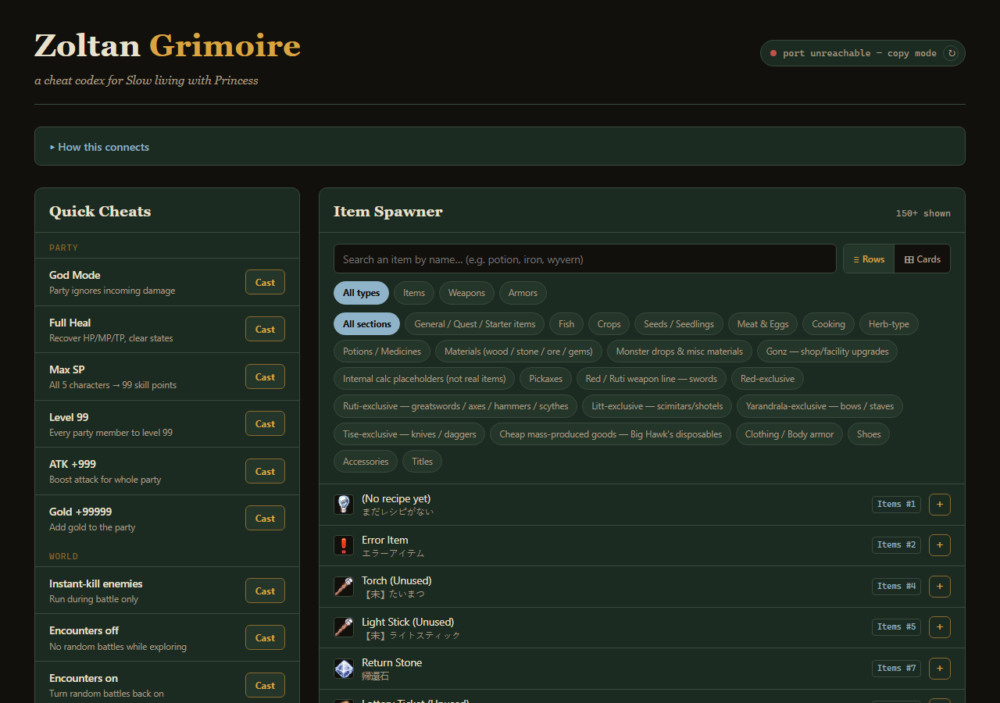
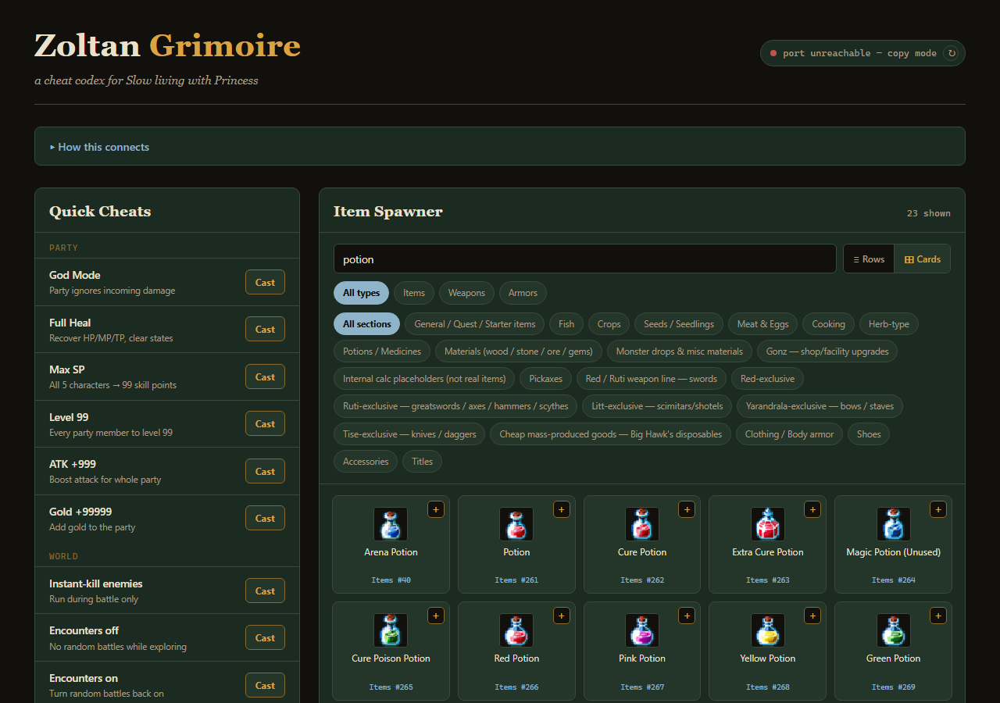
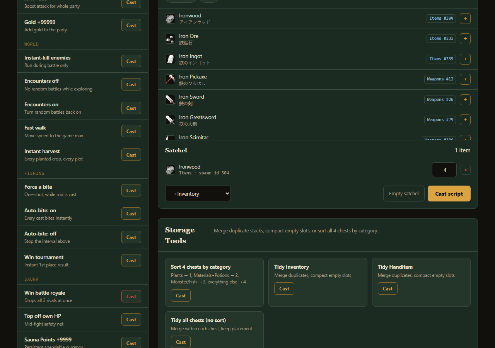

<p align="center">
  
</p>

<h1 align="center">Zoltan Grimoire</h1>
<p align="center"><em>an unofficial cheat codex for <a href="https://store.steampowered.com/">Slow living with Princess</a></em></p>

<p align="center">
  
  
  
  
</p>

---

A point-and-click trainer for *Slow living with Princess*, built by reverse-engineering the
game's save format and plugin source rather than poking at raw memory addresses. No Cheat
Engine, no DLL injection — just the game's own JavaScript, run through its own console.

It started as a chat log: paste item names, get IDs and cheat snippets back, one message at a
time. Once that log passed a hundred item lookups, it made more sense to bottle the whole
lookup table into a page than to keep asking for one item at a time — so that's what this is.

<p align="center">
  
</p>
<p align="center">
  
</p>
<p align="center">
  
</p>

## What it does

**Quick Cheats** — one click for the things you'd otherwise paste by hand: god mode, full
heal, max skill points, level 99, stat boosts, gold, instant-kill in battle, toggling random
encounters, faster walk speed, an instant fishing bite (one-shot or always-on), an
auto-win for the fishing tournament, an auto-win for the sauna battle royale, and an
instant-harvest for every planted crop on the map.

**Item Spawner** — a searchable catalog of all 854 items, weapons, and armor pieces in the
game's database (English names, ID-mapped, icons pulled from the game's own sprite sheet),
with a satchel/cart flow: search, add, set quantity, cast one combined script into your
inventory, hotbar, or any of your four storage chests.

**Storage Tools** — merge duplicate item stacks, compact empty slots, or auto-sort all four
chests into categories (plants / materials & potions / monster drops & fish / everything
else).

**Live Connect** *(optional)* — the page can talk directly to the game over Chrome's
DevTools protocol, so buttons execute immediately instead of copying a script to paste. Off
by default because Chrome blocks it from a normal tab for good reason (see below) — a
disposable-profile launcher is included for anyone who wants it anyway.

## Quick start

1. Launch the game.
2. Open Chrome and go to `http://127.0.0.1:9222`, click the `index` target, leave that tab
   open. *(One-time per session — the game ships with devtools disabled, so this trainer
   also had to re-enable that flag; see [`item_id.md`](item_id.md) for the how and why.)*
3. Open [`trainer.html`](trainer.html) in a normal browser tab.
4. Click a spell, an item's `+`, or a storage tool — it copies a ready-to-run script.
5. Paste it into the DevTools console from step 2, press Enter.

Want clicks to fire instantly instead of copy-pasting? Run
[`launch_trainer_unsafe.bat`](launch_trainer_unsafe.bat) — it opens `trainer.html` in a
throwaway Chrome profile with cross-origin restrictions relaxed *just for that window*, so
the page can reach the debug port directly. Your normal Chrome profile is never touched.
Don't browse anything else in that window while it's open.

## How it works

The game is built on RPG Maker MZ, which means it's really just a Chromium/NW.js app running
plain JavaScript — every plugin, every item ID, every formula is sitting in readable
(if minified) `.js` files on disk. This project came out of actually reading them:

- **Item, weapon, and armor names** were extracted straight from the shipped
  `Items.json` / `Weapons.json` / `Armors.json` and translated — all 854 entries are in
  [`item_database_full.md`](item_database_full.md), a curated "what's actually in my save"
  subset with ready cheat snippets is in [`item_id.md`](item_id.md).
- **Crafted gear** turned out to live in the save under two undocumented ID offsets:
  `1000 + Weapons.json index` for weapons, `10000 + Armors.json index` for armor/accessories
  — found by diffing chest contents before and after crafting.
- **The fishing tournament** sorts all 12 competitors (you + 11 scripted rivals) by score the
  instant the timer hits zero — no hidden RNG at the finish line, just
  `TnmtRed.Point = 9999; TnmtTime = 0`.
- **The sauna battle royale** already has its own "did I kill everyone" check built in
  (`SL_SaunaCharaDead`), so the win-cheat just calls the game's own `SL_SaunaHPgain(-9999,
  "enemy")` instead of faking a result.
- **Crop growth** is a single subtraction (`timecount - planttime >= plantcultivation`) done
  per-plot with dynamically-named keys on `$gameSystem` — zeroing every `planttime*` key
  matures every plot on every map at once.
- **Item icons** in the spawner are cropped live from the game's own `IconSet.png`, which
  ships encrypted (RPG Maker's standard XOR scheme) — decrypted once with the key from
  `System.json` and committed to [`assets/`](assets) so the tool works fully offline.

## Why Live Connect is off by default

Chrome's remote-debugging port is powerful on purpose — anything that can reach it can
read every open tab and run arbitrary code in your browser. Chrome refuses cross-origin
`fetch`/`WebSocket` access to it from a normal page specifically to stop a malicious website
from doing exactly that. `trainer.html` looks like "some random page" to Chrome the same way
an attacker's page would, so it gets the same wall. The disposable-profile launcher works
around that by relaxing the restriction for one throwaway browser instance instead of your
real one.

## Repo layout

```
trainer.html                    the tool — open this
launch_trainer_unsafe.bat       optional: opens it with Live Connect enabled
item_id.md                      items seen in an actual save + every cheat snippet, documented
item_database_full.md           full 854-entry item/weapon/armor reference
assets/IconSet.png              decrypted icon sheet, used by trainer.html
assets/cover.jpg, screenshot-*  README art
```

## Disclaimer

Fan-made and unofficial — not affiliated with or endorsed by the developer or publisher of
*Slow living with Princess*. Built for personal, single-player use against your own save
file. If you like the game, buy it and support the people who made it.
